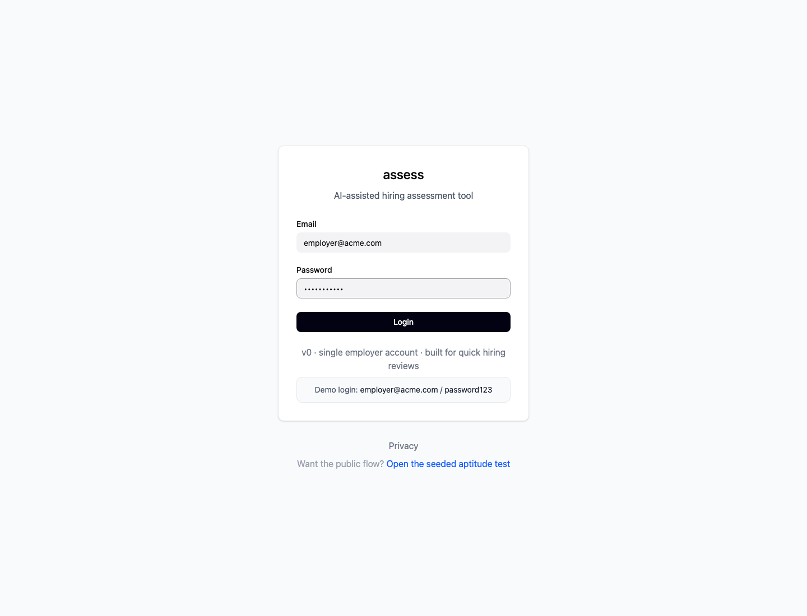
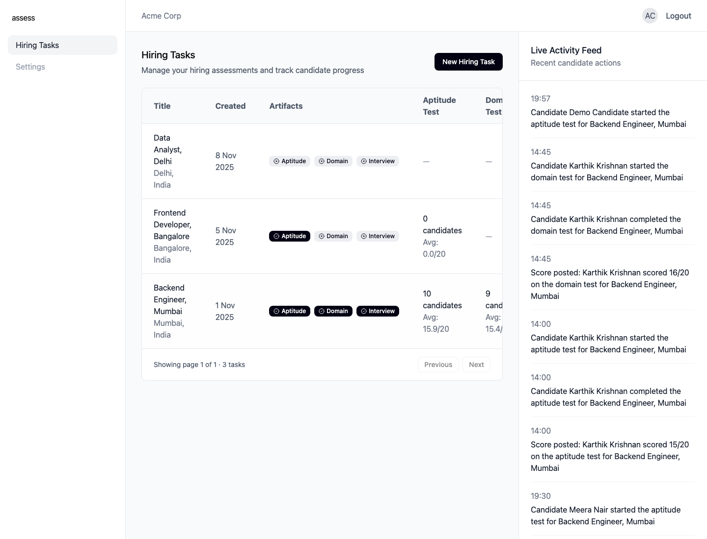
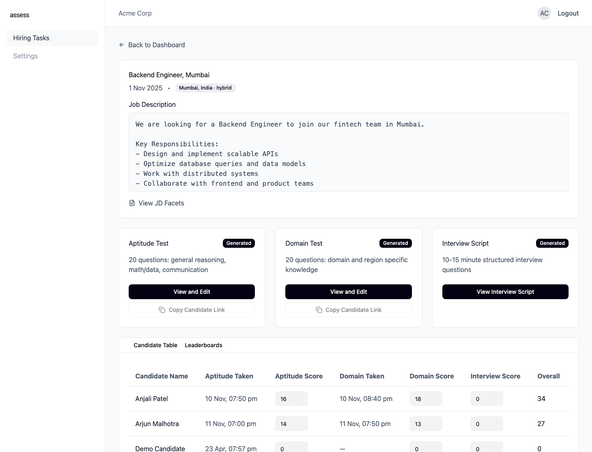
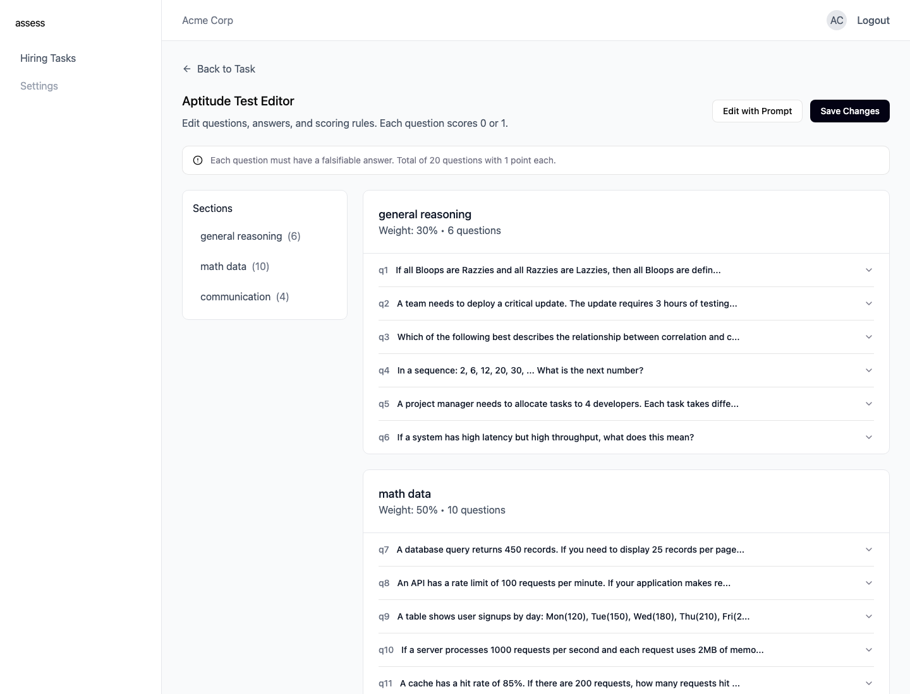
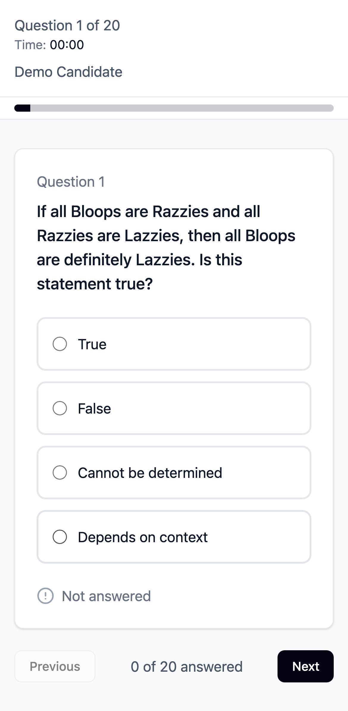

# Assess

**Assess turns a job description into a hiring kit:** an aptitude test, a domain test, and an interview script.

Think of it as a recruiter’s mise en place — less admin, more judgment.


---

## Screenshots

### Login


### Employer dashboard


### Hiring task detail


### Test editor


### Candidate mobile flow
<p align="center">
  
</p>

---

## What’s in the repo right now

### Product surface
- Employer login
- Hiring task dashboard with stats and activity feed
- Hiring task detail page with JD facets, artifacts, candidate table, and leaderboards
- Test editor for 20-question aptitude/domain tests
- Public candidate test flow with autosave, progress, timer, and submission
- Interview script generation + viewer

### Tech stack
- **Frontend:** React + Vite + TypeScript + Tailwind + Radix UI
- **Backend:** Express + Node.js
- **Database:** SQLite via `better-sqlite3`
- **AI:** OpenAI structured outputs, with local fallback generators in non-production for demoability

### Architecture snapshot
- `src/components/*` → top-level screens and UI
- `src/api/*` → frontend API clients
- `server/index.js` → API routes
- `server/repositories/*` → SQLite persistence layer
- `server/services/*` → facets, test generation, scoring, interview scripts, demo seeding
- `data/kyc.sqlite` → local app database (gitignored)

---

## Quick start for reviewers

```bash
npm install
npm run demo:reset
npm run dev
```

Then open `http://localhost:5173`.

### Demo login
- **Email:** `employer@acme.com`
- **Password:** `password123`

### Best path to review the app
1. Log in
2. Open **Backend Engineer, Mumbai**
3. Review the generated aptitude test, domain test, interview script, candidate scores, and leaderboards
4. Open the public candidate flow at `http://localhost:5173/#/t/pub-apt-1`

---

## Current implementation state

This is a strong **V0 / polished prototype-plus**:

### Working well
- persisted local auth session
- seeded hiring tasks, tests, attempts, and leaderboard data
- candidate attempt lifecycle APIs
- autosave + submit flow
- scoring for MCQ, numeric, and rubric-gradable text answers
- editable employer-side test content
- dashboard stats derived from stored attempts

### Intentionally still rough
- single-employer setup only
- voice JD helper is UI-only for now
- interview script is viewable, but not yet fully editable in the employer UI
- no automated test suite yet
- hash-based routing instead of a full router setup

If you’re reviewing this as an interview take-home or portfolio project: yes, the product thinking is ahead of the polish in a few places. That’s deliberate. The important parts are here, the seams are visible, and the system is easy to reason about.

---

## API + data notes

A few useful implementation details:

- Public candidate entry points live at `/t/:publicId` on the frontend and `/api/tests/public/:publicId/*` on the backend.
- Attempt autosaves are persisted in `test_responses`.
- Submission updates `test_attempts`, recomputes stats, and powers the dashboard activity feed.
- Hiring-task stats are stored on the task record for fast dashboard reads.
- `npm run demo:reset` restores the exact reviewer dataset used for the screenshots above.

---

## Reviewer tools included in the repo

To keep the repo interview-friendly, there’s also a small pi skill here:

- `.pi/skills/interviewer-showcase/`

It can be used to:
- reset the demo data
- regenerate README screenshots
- keep reviewer-facing assets current

Screenshot capture script:

```bash
node .pi/skills/interviewer-showcase/scripts/capture-readme-screenshots.mjs
```

---

## Scripts

```bash
npm run dev         # start client + server
npm run dev:client  # frontend only
npm run dev:server  # backend only
npm run build       # production build
npm run demo:reset  # restore deterministic demo data
```

---

## Final note

If you’re here to review the code, start with the dashboard flow.
If you’re here to review the product thinking, start with `AGENTS.md`.
If you’re here to review the candidate experience, open it on your phone.

That’s where Assess earns its keep.
